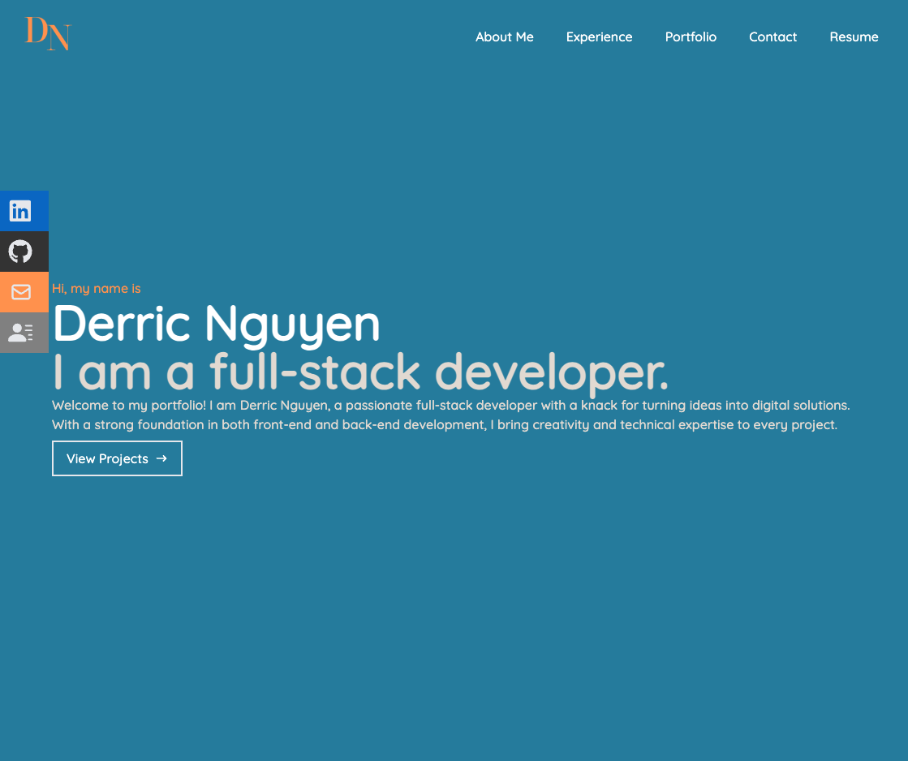

# DN-React-Portfolio

## Description

This project is a single-page application portfolio created using React, aimed at showcasing my skills and projects as a web developer. It is designed to help potential employers and collaborators assess my capabilities and work samples.

## Table of Contents

- [Installation](#installation)
- [Mock-Up](#mock-up)
- [Links](#links)

## Installation

- React
- React-icons
- React-scroll
- React-dom
- React-scripts
- Web-vitals
- JavaScript

To install the project, use the following command: 

```
npm install
```

Once installed, to run the application use the following application:
```
npm run start
```

## Mock-Up

The following image shows the intro to my portfolio, please use the link to view the full application.


## Links

- Deployed: https://derricn2.github.io/DN-React-Portfolio/
- GitHub: https://github.com/derricn2/DN-React-Portfolio
